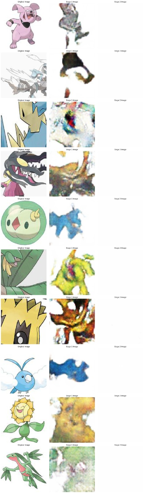
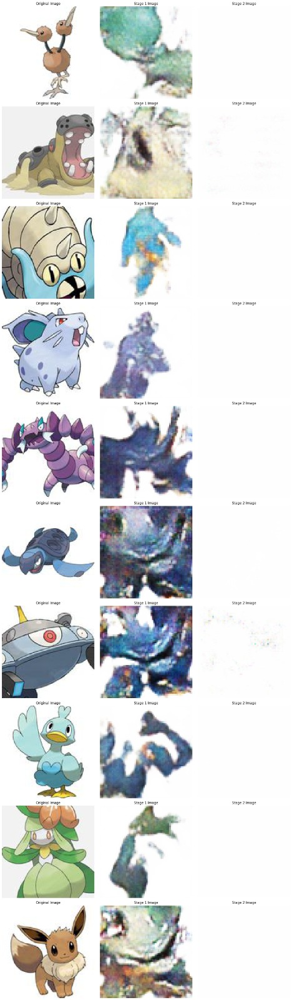
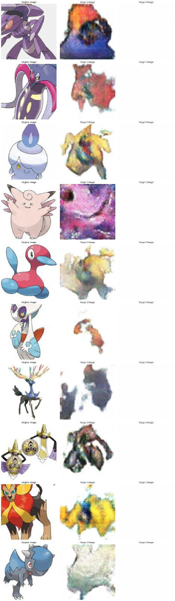

>## Notebook Structure(final_code.ipynb)
Data Loading: Code to load and preprocess text data.

Model Definition: Definitions for the GAN models (Stage-I and Stage-II).

Training Loop: Code to train the GAN models.

Text Embeddings: Functions to obtain text embeddings using GloVe.

Image Generation: Function to generate images from text and display them.

Results:
The generated images can be viewed directly within the notebook after running the corresponding cells. The quality of the images will improve with more training epochs and fine-tuning of the model parameters.

>## Problems we faced 

### 1. Mode Collapse

Each iteration of generator over-optimizes for a particular discriminator, and the discriminator never manages to learn its way out of the trap. As a result the generators rotate through a small set of output types. This form of GAN failure is called mode collapse.
The Wasserstein loss alleviates mode collapse by letting you train the discriminator to optimality without worrying about vanishing gradients. If the discriminator doesn't get stuck in local minima, it learns to reject the outputs that the generator stabilizes on. So the generator has to try something new.
Here, the discriminator is called critique instead, because it doesn't actually classify the data strictly as real or fake, it simply gives them a rating

### 2. Learning Rate Adjustment

The initial learning rate ratio between the discriminator and generator was high, causing instability during training. We adjusted the learning rate to a 1:2 ratio (discriminator:generator), which stabilized training and improved convergence.High Learning Rate for Generator: If the generator's learning rate is too high, it can cause the model parameters to oscillate or diverge rather than converge

### 3. Addition of Dropout Layers
Forcing Discriminator to Generalize: By reducing the reliance on specific features or patterns, dropout encourages the discriminator to learn more generalizable features that are relevant across different samples. This prevents the discriminator from memorizing the training data and helps it generalize better to unseen data.

>## Instructions for this repo-

>The final code is in final_code.ipynb

>data_augmentation is a file acessed during execution of final_code.ipynb and is used for data augmentation

>The results of the first stage-

>- 

>- 

>- 

>- 

>We have only attached results from our first stage, as second stage was giving a white screen like so -

>A screenshot of the code in action

>- 

>We have also attached saved trained models for G1,G2,D1,D2
